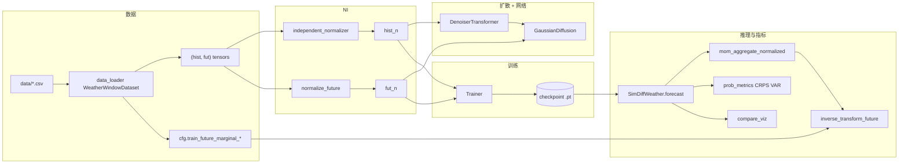

# Simdiff_weather：项目架构与算法框架说明（`tell`）

本文面向**初次通读仓库**或与 `docs/DEVELOPMENT_LOG.md`（迭代记录）、`docs/EXPERIMENT_ARCHITECTURE.md`（去噪器/消融表格）并列查阅：描述**模块职责**、**数据与控制流**，以及 SimDiff 在本科设版本中的**整体算法**。实现以当前代码为准。

---

## 1. 项目定位（一句话）

在表格时间序列上做**条件扩散预报**：给定历史窗口 `hist`，通过学习去噪网络在「**归一化后的未来序列**」上还原噪声（训练），推理时用 **DDIM/DDPM 反过程**采样多条轨迹，经 **Median-of-Means（MoM）** 等得到点预测，并与 **iTransformer / TimeMixer** 等判别式基线在相同划分下对比 **MAE、MSE、CRPS、VAR**。

仓库展示名统称为 **SimDiff**；默认实现中包含 **Normalization Independence（NI）**、可选 **RevIn / HistoryAdditiveBias**、编码器可选 **RMSNorm 堆栈**、历史可选 **多尺度拼接**——这些在论文叙事中可归入「SimDiff 配置」，细节见下文与 `EXPERIMENT_ARCHITECTURE.md`。**单列目标 `data/wind.csv`→`OT` 的落地步骤见 §7。**

## 2. 目录与职责总览

| 路径 | 职责 |
|------|------|
| `config/config.py` | 超参数与路径：`seq_len`、`pred_len`、扩散步数、`make_loaders` 写入的运行时字段（如 `train_future_marginal_*`、`hist_window_start_min`、`multiscale_steps_per_hour`）、checkpoint 命名规则等。 |
| `main.py` | CLI 组装 `Config`、`make_loaders`、`SimDiffWeather`、`Trainer`，训练结束后加载测试、`forecast`/`evaluate_*`、基线训练与画图、写入 `result/<数据集>/`。 |
| `utils/data_loader.py` | CSV → 矩阵；按时间划分 train/val/test；`WeatherWindowDataset` 滑动窗；可选**多尺度**历史 `_concat_multiscale_history`；**训练集未来边际** μ/σ 供无真值反变换。 |
| `utils/independent_normalizer.py` | **NI**：`normalize_history` / `normalize_future` 分离统计量；多尺度时用 `hist_stats_span=seq_len`；MoM 在归一化空间对 K 轨迹聚合。 |
| `models/diffusion.py` | `GaussianDiffusion`：余弦 β、前向 `q_sample`、训练噪声损失、采样（含 DDIM 时间表与推理混合精度钩子）。 |
| `models/network.py` | `DenoiserTransformer`：历史与未来 token 拼接、扩散步嵌入、可选 RevIN/历史加性偏置、Transformer（LN 或 **RMSNorm 层**，见 `revin_rms`）。 |
| `models/revin_rms.py` | `RevINPatch`、`HistoryAdditiveBias`、基于 **Pre-RMSNorm** 的编码层 `DenoiserEncoderLayerRMSPre`。 |
| `models/simdiff.py` | `SimDiffWeather`：装配 `diffusion + net`；`training_loss`、`forecast`（K 采样 → MoM → 逆变换）；`ForecastOutput`、`point_prediction_from_forecast`。 |
| `utils/trainer.py` | 训练循环、验证（噪声损失）、**固定学习率**（无调度器）、早停、**EMA**、保存 `checkpoint`（含 `_config_to_meta`）。 |
| `utils/baselines.py` | iTransformer、TimeMixer 等；`BaselineHistTrim` 在多尺度时只喂细粒度段；与 SimDiff **同一原始尺度**损失与评估。 |
| `utils/compare_viz.py` | overlay、柱状 MAE/MSE、训练曲线等（图例与时间轴对齐逻辑集中在此）。 |
| `utils/prob_metrics.py` | 如 CRPS（集合预报 vs 标量真值）。 |
| `utils/result_output.py` | 终端 ASCII 指标表（MAE/MSE/CRPS/VAR）。 |
| `utils/normalizer.py` | 与早期全局标准化相关的保留接口；主干 NI 不以它为训练目标。 |
| `verify_norm_mom.py` | NI + MoM 快速自检脚本。 |
| `scripts/` | 论文/助教向的批量实验与作图脚本，非 `main.py` 必读路径。 |

---

## 3. 整体算法框架（概念流水线）

可以把一次「从数据到报告」的流程看成以下几段：

1. **数据层**：滑动窗口样本 `(hist, fut)`；`hist` 长度在单尺度为 `seq_len`，多尺度为 `seq_len + 11`（细粒度块 + 日池化 + 周池化）；`fut` 长度为 `pred_len`。仅用**过去**索引构造标签，窗口起点受多尺度回溯约束（`hist_window_start_min`）。
2. **Normalization Independence（NI）**：  
   - 条件：**仅**依赖 `normalize_history(hist, hist_stats_span=seq_len)` 后的序列（避免池化尾巴污染尺度）。  
   - 训练目标：**在** `normalize_future(future)` 空间对「干净未来」做扩散加噪并让网络预测噪声 ε。  
   - 推理反变换：`forecast` 中若给定真值窗口（评估模式），用**该 batch** 未来上的 μ_f、σ_f；若无真值，用 **`make_loaders`** 写入的训练集「仅未来窗口」边际统计量——与 NI 语义一致。
3. **扩散训练**：随机时间步 \(t\)，`q_sample(x0, t)` 得 \(x_t\)，`DenoiserTransformer` 以 `(tokens, hist_n, t)` 预测 ε，损失在 `GaussianDiffusion.training_losses` 中（可含 L1/Huber/时间差分正则等权重，见 `Config`）。
4. **扩散推理**：对每个 batch 复制 K 份条件历史，并行（或等价展开）采样，默认 **DDIM**，得到 \(K\) 条归一化未来轨迹 `(B,K,L_f,C)`。
5. **MoM 点预报**：在归一化空间对 K 轨迹分组求组内均值，再对组均值取中位数（及可选「低温加权」凸组合），然后 **inverse_transform_future** 到物理尺度；`point_prediction_from_forecast` 在 `full` 等模式下取 **MoM** 作为默认点估计。
6. **基线与报告**：判别式模型在原始尺度上做 MSE/MAE；终端表与柱状图对齐 **同一主变量索引**（如 OT、气温列）。

以下为数据—模型—训练的简化关系（Mermaid）。



---

## 4. 模块如何相互衔接（关键调用链）

### 4.1 启动：`main.py`

- 解析 CLI → 填充 **`Config`**（数据路径、`seq_len`/`pred_len`、是否多尺度、扩散步、`simdiff_checkpoint_extra_suffix` 等）。
- **`make_loaders(cfg)`**：读 CSV、`cfg.input_dim`、写 **`train_future_marginal_mean/std`**、创建 DataLoader。
- 构造 **`SimDiffWeather(cfg)`**：内部断言边际已就绪，创建 **`DenoiserTransformer`**（`effective_hist_len()` = 多尺度时 `seq_len+11`）与 **`GaussianDiffusion`**。
- **`Trainer.fit()`** 或 **`--eval_only`** 加载权重。
- 测试阶段：**`forecast(..., future=future, return_samples=True)`** 汇总 MAE/MSE/CRPS/VAR； **`baselines.fit_regression_model`** 训练对比模型； **`compare_viz` / `result_output`** 出图与表。

### 4.2 数据与控制形状

- **`Config.effective_hist_len()`**：必须与 `WeatherWindowDataset` 输出的 `hist` 第一维长度一致，否则 Transformer 位置编码错位。
- **多尺度与采样间隔**：`resolve_multiscale_steps_per_hour` 决定「一天多少步」（如 ETTh=1，ETTm / `wind`=4），进而决定日/周池化块长度；`hist_window_start_min` 保证每个窗口左侧有足够历史拼接池化段。
- **`BaselineHistTrim`**：基线只吃 `hist[:, :seq_len, :]`，与「SimDiff 用全长条件」对齐公平性说明（CLI 中会打印提示）。

### 4.3 训练目标 vs 终端 MAE

- **验证早停**：`Trainer` 主要看 **噪声预测损失**，不是每条 epoch 全流程扩散采样的预报 MAE（原因与取舍见 DEVELOPMENT_LOG 中 validate 讨论）。
- **测试 MAE/MSE**：基于 **`forecast` + MoM（或消融）后的点预测**，在**原始尺度**与真值比。

---

## 5. 子模块功能摘要

### 5.1 `config.Config`

数据中心路径、模型宽度/深度、扩散步、cDDIM、MoM 的 K/M、训练噪声正则、EMA、基线 epoch 上限、结果目录 **`result/<data_stem>/`** 逻辑名与 checkpoint 后缀等。部分字段由 **`make_loaders`** 回填（如 **`multiscale_steps_per_hour`**）。

### 5.2 `utils/data_loader.py`

- **`load_weather_matrix`**：`date` 列丢弃 → float32矩阵。
- **`resolve_temperature_column_name`**：默认单变量时选气温别名或 **`OT`** 等。
- **`WeatherWindowDataset.__getitem__`**：`fut` 仅从 `t ≥ i+seq_len` 取用；多尺度 **`_concat_multiscale_history`** 仅从过去取块。
- **`fit_future_marginal_stats`**：训练集每个样本的未来张量聚合成每通道边际，写入 `cfg`。

### 5.3 `utils/independent_normalizer.py`

- **`normalize_history`**：`(B,Lh,C)` → 用前缀 `hist_stats_span` 步估计 μ_h, σ_h，对整段标准化。
- **`normalize_future`**：仅用 future 估计 μ_f, σ_f。
- **`inverse_transform_future`**：反标准化。
- **`mom_aggregate_normalized`**：对 `(B,K,L,C)` 做 MoM（及可选 cold-bias）。

### 5.4 `models/diffusion.py`：`GaussianDiffusion`

- **前向**：`q_sample`。  
- **训练**：给定 `net`、`x0`、`t`、`hist_n`，构造 `x_t`，优化 ε 预测误差（混合损失见实现）。  
- **采样**：`sample` — 支持 DDIM 时间对与步数裁剪、可选返回轨迹、`autocast` 推理开关。

### 5.5 `models/network.py` + `models/revin_rms.py`

- **拼接 token**：长度为 `Lh + pred_len`；对未来段加 **扩散步的正弦+MPE**，与历史 positional embedding 区分。
- **三条互斥嵌入路径**：RevIN（可对末段 denorm）；或 HistoryAdditiveBias；或直通。
- **编码**：`use_rmsnorm` 时使用自定义 **Pre-RMSNorm** 多层；否则 `TransformerEncoder`。

### 5.6 `models/simdiff.py`：`SimDiffWeather`

- **`training_loss`**：`hist_n`、`fut_n`（含 `mom_only` 分支用历史尺度归一未来）、调用 `diffusion.training_losses`。
- **`forecast`**：`normalize_history` → K×`sample` → `mom_aggregate_normalized` → 选 μ_f,σ_f（真值窗口或边际）→ **`inverse_transform_future`**。
- **`point_prediction_from_forecast`**：`ni_only` 用算术均值样本，主线用 MoM。
- **`get_denoise_trajectory_physical`**：可视化用，非训练核心路径。

### 5.7 `utils/trainer.py`

- AMP、梯度裁剪、验证集噪声损失、**固定 lr**、**`_ModelEMA`**、保存 best checkpoint 及 **meta**（便于追溯数据与结构配置）。

### 5.8 `utils/baselines.py`

- **`BaselineiTransformer` / `BaselineTimeMixer`** 等：**共享 DataLoader**，在 `(hist_trimmed, fut)` 上端到端回归； **`eval_*`** 函数供 `main` 复用打印与柱状数据。

### 5.9 `utils/compare_viz.py` 与 `utils/result_output.py`

- Overlay：时间轴必须从 **`hist.shape[0]`** 推导未来起点，并与「历史末点至未来首点」绘图衔接逻辑一致（见 DEVELOPMENT_LOG 中 overlay 条目）。
- 终端表：**MAE/MSE** 数值；SimDiff **CRPS** 来自采样集合；**VAR** 为样本方差在 batch× horizon 上的平均（点预测模型对应列退化）。

---

## 6. 消融与改名空间（延伸阅读）

与**「整块架构」关系**：`simdiff_ablation`（`full` / `ni_only` / `mom_only`）控制 NI+MoM 语义；而去噪器的 RevIn / RMSNorm / 多尺度历史等由 **`Config` + CLI + `EXPERIMENT_ARCHITECTURE.md`** 表格描述。**双消融流程**（`--revin_rms_ablation`、`--ms_rms_ablation`）在 `main.py` 中分支为独立套件，.checkpoint 前缀与套件名写入 meta。

---

## 7. 实例：`data/wind.csv` 上如何预测 **OT**

以下说明与当前代码路径严格对应：默认 **`python main.py --data_path data/wind.csv`**、**不写 `--all_features`**。

### 7.1 数据源与被选中的列（为何是 OT）

1. **`load_weather_matrix`**：`pandas.read_csv` 后删掉 **`date`**，其余列名保留；数值转成 **`float32`**，NaN 用列均值等规则填齐。  
2. **`Config.temperature_only=True`（默认）**：`make_loaders` 调用 **`resolve_temperature_column_name(names)`**。对 `wind.csv`：**气温类列名不存在于表头**，循环命中 **`name.strip() == "OT"`**，于是**只保留一列**：列名为 **`OT`**，`matrix.shape == (T, 1)`。  
3. 因此 **`cfg.input_dim = 1`**，全流程张量形如 **`hist: (B, Lh, 1)`**、**`fut: (B, pred_len, 1)`**。所谓「预测 OT」在网络里即预测**该单列未来 `pred_len` 步**。  
4. **`--all_features`** 会为多变量建模（多通道），与本条「单列 OT」实验**无关**；要写 OT-only 时不要加该项。

### 7.2 时间分辨率与 **15 分钟**（多尺度日历）

`wind.csv` 时间戳为 **00:00 → 00:15 → …**，即每小时 **4 步**。  
**`resolve_multiscale_steps_per_hour`**（`data_loader.py`）：在显式 **`--multiscale_steps_per_hour` 未给定**且 CSV 文件名 stem 为 **`wind`** 时，返回 **`4`**。

后果：

- **日尺度块**：\(7 × 24 × 4 = 672\) 个原始步（7 天）；**周尺度块**：\(28 × 24 × 4 = 2688\) 步（28 天），与 **`_concat_multiscale_history`** 内公式一致（仍按「日历天 × 每小时步数」构造）。  
- **多尺度最短窗口起点**：**`hist_window_start_min = 2688 - seq_len`**（默认 `seq_len=96` 时为 **2592**）。数据集内索引 **`i`** 从 **`window_start_min`** 起，保证向左能取满周池化段，仅用 **`< i + seq_len` 的历史**，**不包含**与之拼接的未来 **`fut`**（无标签泄漏）。

若关闭多尺度（**`--single_scale_hist`**），则 **`Lh = seq_len`**，**`hist_window_start_min = 0`**，行为与一般单尺度序列一致，但不再有日/周池化 token。

### 7.3 每个训练 / 测试样本具体长什么样

对划分后的一段长度为 \(T'\) 的 OT 序列，样本索引 **`idx`**：

- **`i = idx + window_start_min`**。  
- **未来标签**：对 `k = 0, …, pred_len - 1`，有 `fut[k] = data[i + seq_len + k]`，即用 **OT** 在时间上紧接在历史段之后的 **`pred_len` 步**真值片段。  
- **历史**：  
  - **多尺度开（默认）**：**`hist = concat( 细粒度 [i : i+seq_len], 7 个日粒度均值 token, 4 个周粒度均值 token)`**，长度为 **`seq_len + 11`**；其中池化段的值都是 **≤ anchor = i + seq_len** 的历史子序列在原始 OT 上做 reshape-mean。**所有池化用到的 OT 取值均严格早于 **`fut` 的起点**。  
  - **单尺度**：**`hist = data[i : i+seq_len]`**。

- 按 **`Config`** 的比例（默认 **70% / 15% / 15%**）在时间轴上切成 train / val / test，**不打乱**，因此评估的是「按时间顺延」的 OT 预报泛化。
- **与其它 CSV 的差别**：主要在于 **`wind` stem → `steps_per_hour=4`**（及由此给出的 **`Lh`、`hist_window_start_min`**）；滑动窗 **`WeatherWindowDataset`** 的规则不变。

**`fit_future_marginal_stats(train_ds)`**：只在**训练集**上，对每个样本的 **`fut`（pred_len×1）** 聚集，得到 **OT** 维度上的 **`train_future_marginal_mean`、`train_future_marginal_std`**，写入 **`cfg`** 并写入 SimDiff **`register_buffer`**。

- **评测阶段**若在 **`forecast(..., future=future)`** 里传入 batch 的真值 **`future`**：**反变换使用该 batch 上用 **`normalize_future` 定义的 μ_f, σ_f**（与 **`training_loss` 目标空间一致**）。  
- **真占位推理**不传 `future` 时：**用上述训练集边际** μ, σ ——不涉及测试标签。

### 7.5 训练时模型在学什么（仍以 OT 为唯一通道）

1. **`normalize_history(hist, hist_stats_span=seq_len)`**：**只用前 `seq_len` 个细粒度 OT 步**估计 μ_h, σ_h，再对 **整段 `hist`（含池化段）** 标准化得到 **`hist_n`**。避免把「日为 7 token、周为 4 token」的低频段混进均值方差而把条件尺度弄脏。  
2. **`normalize_future(future)`**：仅在未来 **`pred_len`** 维上估计 μ_f、σ_f，得 **`fut_n`**（单通道就是一维向量上的 μ/σ）。  
3. **扩散**：在高斯日程下 **`fut_n`** 视作 \(x_0\)，采样随机 **`t`**，加噪得到 \(x_t\)；**`DenoiserTransformer`** 输入 **`hist_n` + 未来 token（当前带噪）+ 嵌入的 \(t\)**，预测噪声 **ε**。损失为 **`GaussianDiffusion.training_losses`**（可含平滑 L1、时间差分项等，`Config` 可调）。

即：**学习目标始终是「给定归一化多尺度 OT 条件，建模归一化未来 OT」**；与其它 CSV 的差别仅在于 **`hist`** 的形态与 **`steps_per_hour`**。

### 7.6 推理时如何得到 OT 的点预测（与概率指标）

1. **`forecast`**：同上得到 **`hist_n`**；重复 **K 次**采样（默认配置见 **`forecast_num_samples`**），得到 **`(B, K, pred_len, 1)`** 的归一化轨迹。  
2. **`mom_aggregate_normalized`**：**Median-of-Means**（及可选低温加权），在归一化空间得到 **`mom_n`**（与 **`point_prediction_from_forecast`** 默认一致）。  
3. **`inverse_transform_future(mom_n, μ_f, σ_f)`**：将 **整条未来 OT** 拉回**原始 CSV 中表示 OT** 的物理数值尺度。评测时 **`μ_f, σ_f` 来自本 batch 真值 **`future`** 上的 NI 定义**。

**CRPS / VAR**：在 **`return_samples=True`** 时对 **K** 条**已反变换**样本与真值计算（单通道 OT）；点预测基线无样本，CRPS 退化为与 MAE 一致、VAR 为 0（见 **`result_output` 脚注**）。

### 7.7 基线（iTransformer / TimeMixer）如何「预测同一 OT」

**同一 `DataLoader`**；多尺度时 **`BaselineHistTrim`** 只把 **`hist[:, :seq_len, :]`** 交给基线，即 **与 SimDiff 细粒度段对齐**的 **OT 历史**，输出 **`(B, pred_len, 1)`** 与真值 **MSE/MAE**，与 SimDiff 在 **同一测试集、同一主变量索引**上比较（此时通道 0 即 **OT**）。

### 7.8 权重与结果落盘（避免与 `weather` 串台）

- 当 **`data_path`** 指向 **`wind.csv`** 且 **未**指定 **`--ckpt_extra_suffix`** 时，**`main.py`** 将 **`simdiff_checkpoint_extra_suffix`** 设为 **`_wind`**，默认保存 / 加载 **`checkpoints/simdiff_weather_best_wind.pt`**，避免覆盖 **`simdiff_weather_best.pt`（weather 实验）**。  
- 图表与表：**项目根目录 `wind/`**（文件名 stem 为 **`wind`** 时 `resolved_result_dir()` 映射到 `./wind`，与其它数据集的 **`result/<stem>/`** 不同），如 **`bar_mae_mse_comparison_*`（论文口径 MAE_z/MSE_z）**、**`bar_mae_mse_physical_*`（物理尺度 MAE/MSE）**、**`forecast_curves_overlay_*.png`**。

### 7.9 推荐命令（归档）

```bash
# 训练 + 测试 + 基线 + 出图出表
python main.py --data_path data/wind.csv

# 仅评估（需已有 checkpoints/simdiff_weather_best_wind.pt）
python main.py --data_path data/wind.csv --eval_only
```

若需与 ETTm 一样**强制**指定 15min 语义，可显式加 **`--multiscale_steps_per_hour 4`**（与 stem 推断结果一致）。单尺度对照加 **`--single_scale_hist`**。

---

## 8. 阅读顺序建议

1. 本文 **`tell.md`**（全局图；**OT / wind** 见 **§7**）  
2. **`config/config.py`** 中与当前实验相关的字段  
3. **`models/simdiff.py`**（训练一句 `training_loss`、推理一句 `forecast`）  
4. **`utils/independent_normalizer.py`**（NI 边界）  
5. **`utils/data_loader.py`**（窗口与多尺度）  
6. **`main.py`** 主流程尾部（评估、基线、毕设图）  
7. **`docs/DEVELOPMENT_LOG.md`**（某次改动的动机与细节）  
8. **`docs/EXPERIMENT_ARCHITECTURE.md`**（开关与 checkpoint 命名表）

---

*文档名 `tell` 表示「对项目的口述式总览」；若与具体 commit 行为不一致，以代码与 `DEVELOPMENT_LOG` 为准。*
